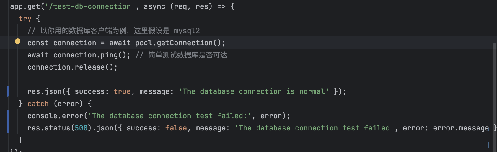
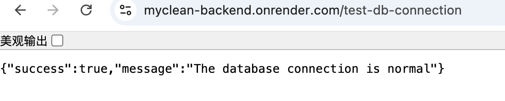
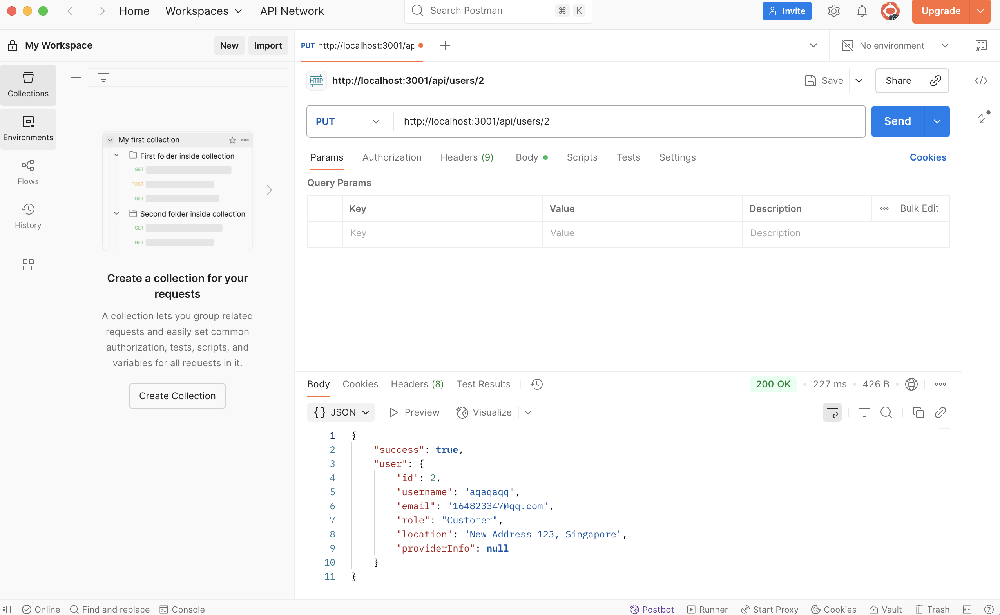

### ✅ Test 1: In-Code Unit Testing

To ensure critical backend logic functions correctly, **unit tests were directly embedded within the backend source code**. These tests are lightweight and serve as immediate validation during development.

### ✦ Scope of Testing:
- **Database Connection:** Validates successful connection to the MySQL database using the configured credentials and environment variables.
- **User Registration:** Simulates new user sign-up with valid and invalid input payloads. Tests uniqueness constraints (e.g., duplicate emails).
- **User Login:** Verifies login behavior for:
  - Correct credentials
  - Incorrect password
  - Non-existent users
- **Edge Case Handling:** Tests unexpected or malformed inputs (e.g., empty fields, invalid formats).

### ✦ Execution:
Test functions were written inside relevant controller files (e.g., `authController.js`) and executed manually via local `node` runtime or test endpoints. Console logs were used to display results and validate logic flow.

> ✅ **Example**: Before attempting to connect to the database via the front end, automatically output the connection status between the back end and the database first

## ✅ Test 2: API Testing with Postman

A comprehensive set of manual tests were conducted using **Postman** to verify that the backend RESTful API endpoints behave correctly when interacting with real-world HTTP requests.

### ✦ Key Features Tested:
- **User Authentication APIs:**
  - `POST /register`: Tested with new and duplicate users.
  - `POST /login`: Verified access tokens and error responses.
- **Provider Profile Management:**
  - `PUT /update-provider`: Confirmed that fields like `serviceTypes`, `location`, and `hourlyRate` are updated correctly.
- **Booking System:**
  - `POST /booking`: Ensured that new bookings are created successfully and linked to both customer and provider.
- **Role-Based Access Control:**
  - Verified that unauthorized access to provider/admin-only endpoints is blocked with appropriate 403 errors.

### ✦ Testing Approach:
- Used preconfigured test accounts (e.g., `testuser@example.com`) and authorization tokens.
- Checked:
  - **Status codes** (200, 400, 401, 403)
  - **Response bodies** (JSON structure and content)
  - **Side effects** (e.g., database changes after POST/PUT)
