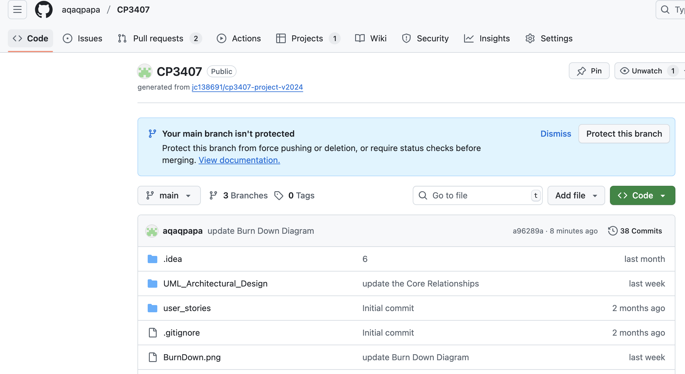
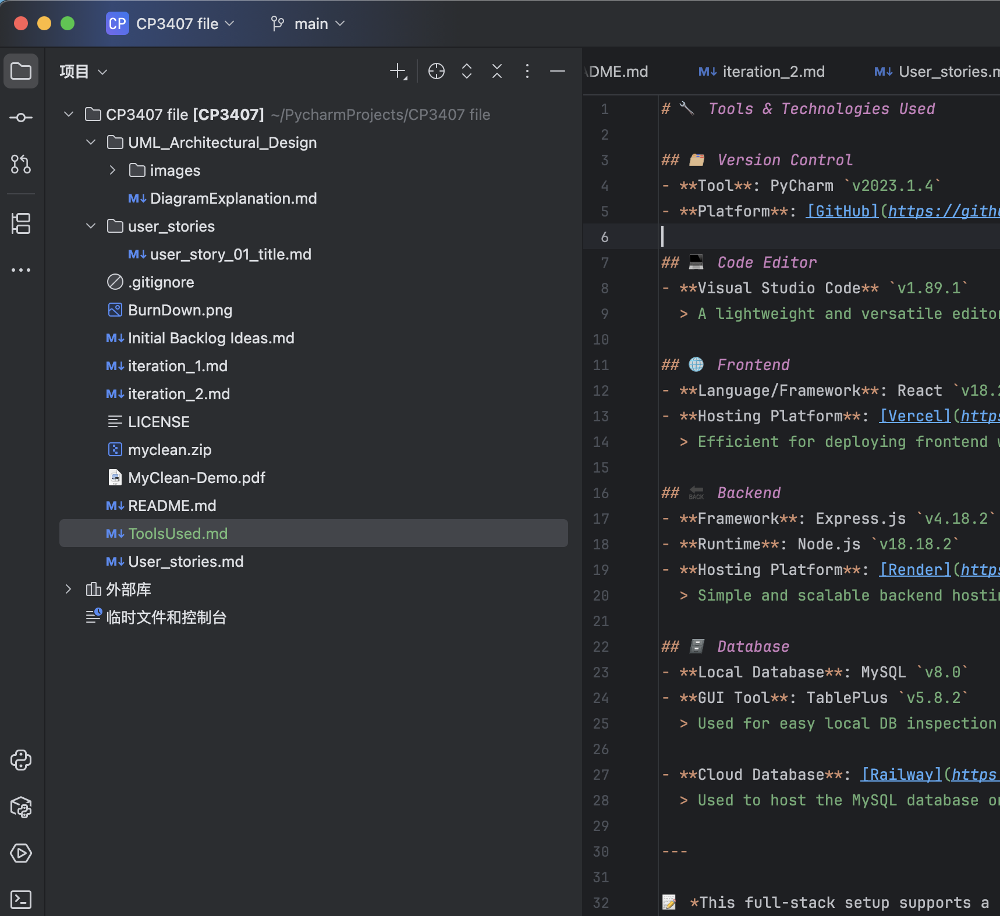
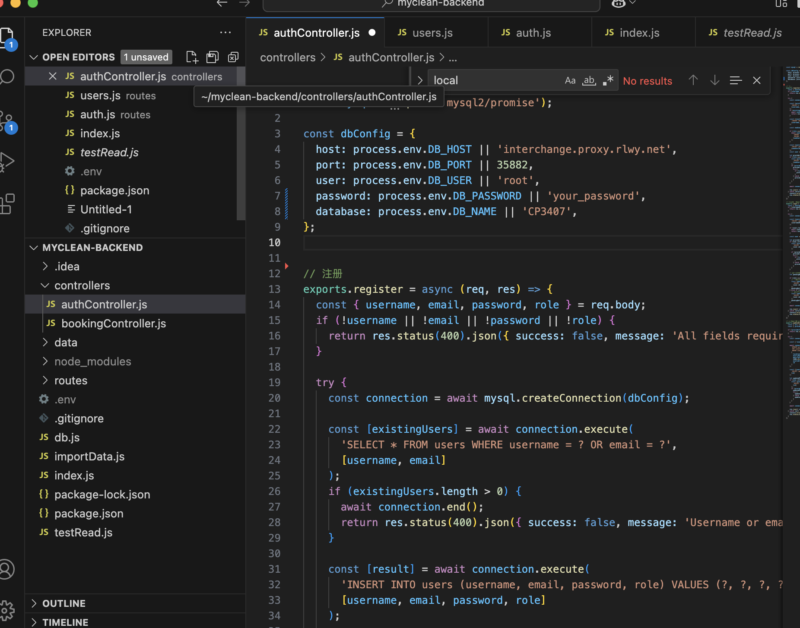
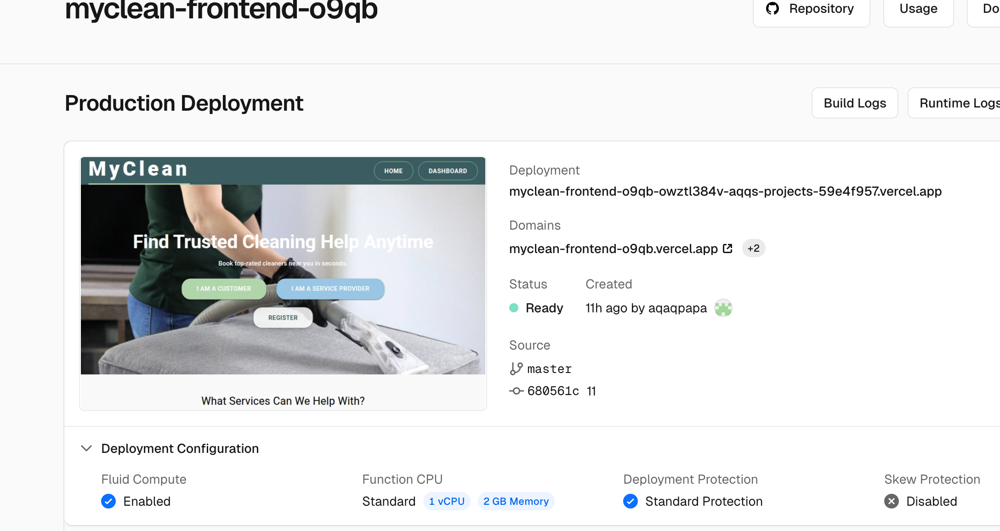
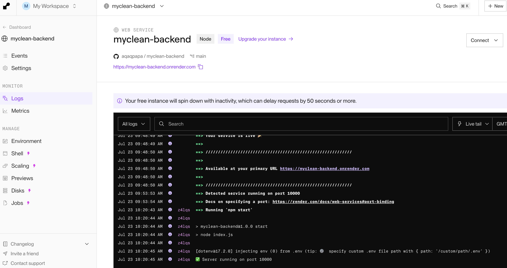
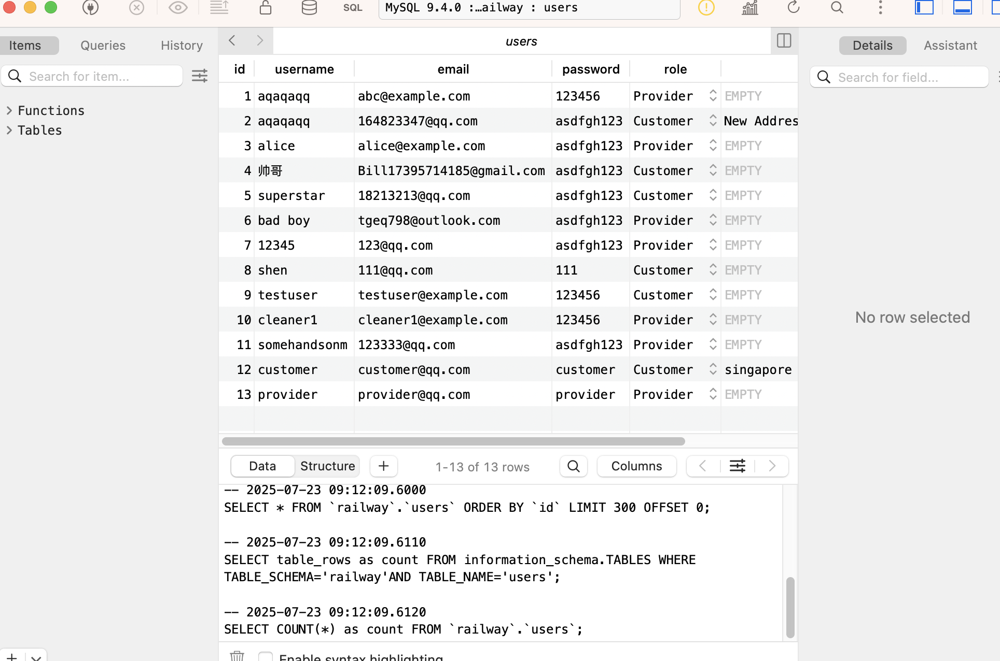
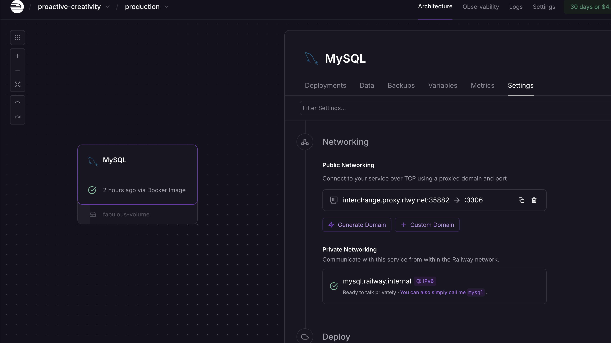
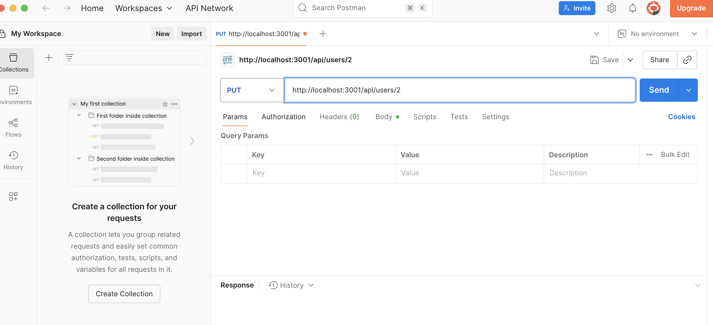

# 🔧 Tools & Technologies Used

## 🗂️ Version Control  
- **Tool**: PyCharm `v2023.1.4`  
- **Platform**: [GitHub](https://github.com)  
  > Used for source control, code commits, and version tracking.

## 💻 Code Editor  
- **Visual Studio Code** `v1.89.1`  
  > A lightweight and powerful editor used for both frontend and backend development.

## 🌐 Frontend  
- **Language/Framework**: React `v18.2.0`  
- **Hosting Platform**: [Vercel](https://vercel.com)  
  > Easy-to-use platform for frontend deployment with Git integration and serverless support.
  
## 🔙 Backend  
- **Framework**: Express.js `v4.18.2`  
- **Runtime**: Node.js `v18.18.2`  
- **Hosting Platform**: [Render](https://render.com)  
  > Used to host the backend service with environment configuration and HTTP routing.

## 🗄️ Database  
- **Local Database**: MySQL `v8.0`  
- **GUI Tool**: TablePlus `v5.8.2`  
  > Used for local database management, queries, and schema editing.

- **Cloud Database**: [Railway](https://railway.app)  
  > A cloud platform for hosting the production MySQL database with both public and private access.

## 🔁 API Testing  
- **Tool**: [Postman](https://www.postman.com) `v10.24.16`  
  > Used for testing RESTful APIs including authentication, data validation, and error handling.

---

📝 *This full-stack environment combines robust local development tools with scalable cloud services, ensuring streamlined deployment, collaboration, and testing workflows.*
