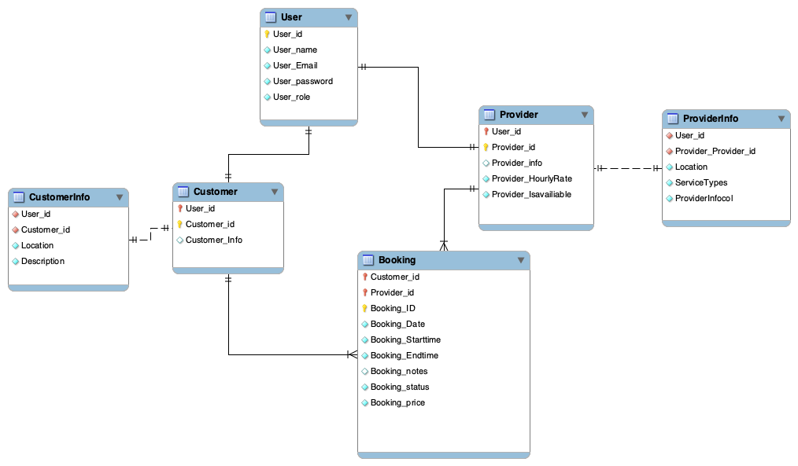
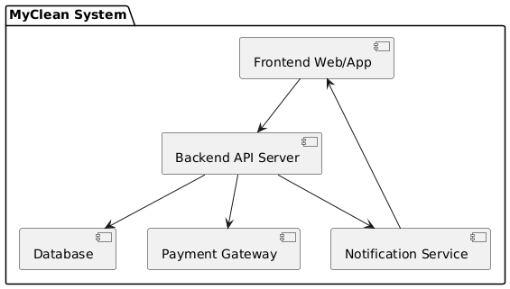
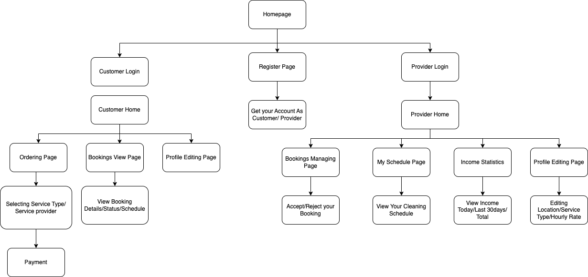
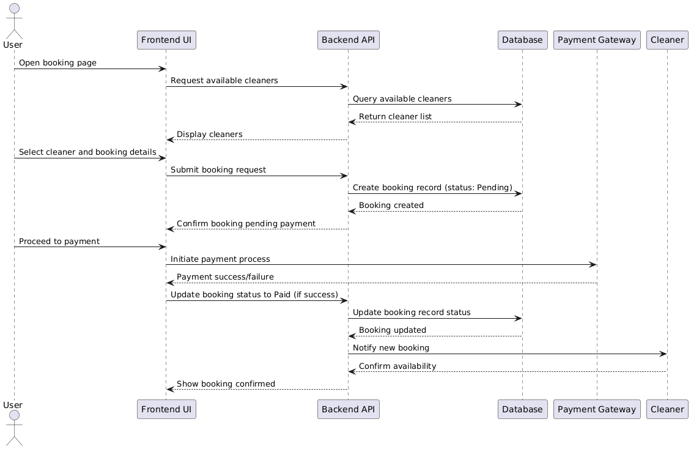
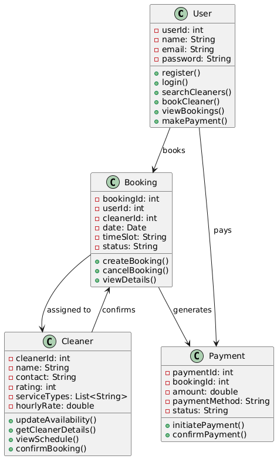

## Core Entities and Their Attributes

**User** – generic account data:  
`User_id`, `User_name`, `User_Email`, `User_password`, `User_role`.

**Provider** – a user who offers services:  
`Provider_id`, `Provider_info`, `Location`, `Provider_HourlyRate`, `Provider_IsAvailable`, `ServiceTypes`.

**Customer** – a user who books services:  
`Customer_id`, `Location`, `Customer_Info`, `Description`.

**Booking** – the actual service request:  
`Booking_ID`, `Booking_Date`, `Booking_Starttime`, `Booking_Endtime`, `Booking_notes`, `Booking_status`, `Booking_price`.

### Relationships

- A **User** can become either one **Provider** and/or one **Customer** (1-to-1 subtype relations shown with arrows and `↑ User_id`).
- A **Customer** places many **Bookings** and a **Provider** receives many **Bookings**  
  (1-to-many, shown by `↑ Customer_id` / `↑ Provider_id`).

---

## Main Classes & Key Attributes

**User**: `id`, `name`, `email`, `password`  
**Cleaner**: `id`, `name`, `contact`, `service types`, `hourly rate`, `rating`  
**Booking**: `id`, `user & cleaner ids`, `date`, `time slot`, `status`  
**Payment**: `id`, `booking id`, `amount`, `method`, `status`  
**Review**: `id`, `booking id`, `rating`, `comment`  
**Notification**: `id`, `receiver user id`, `message`, `read flag`

### Core Relationships

- Users register/login, search for cleaners, book them, pay, write reviews, and receive notifications.
- Cleaners update availability, confirm bookings, view schedules, and get paid & reviewed.

---

## Component Diagram: MyClean System

This component diagram shows the **MyClean System** split into five parts:

1. **Frontend Web/App** – what users and cleaners interact with.  
2. **Backend API Server** – the core business logic.  
3. **Database** – stores users, bookings, payments, etc.  
4. **Payment Gateway** – handles online payments.  
5. **Notification Service** – sends emails/SMS/push alerts.

All parts connect to the **Backend API Server**, which orchestrates everything.

---

## App Architecture: Main Screens

This diagram shows the main screens/pages of the MyClean app:

- **Entry screens**: Homepage, Register Page, and separate logins for Customer and Provider.  
- **Customer area**:  
  `Customer Home → Ordering Page → Bookings View Page → Profile Editing`  
- **Provider area**:  
  `Provider Home → My Schedule → Income Statistics → Profile Editing`  
- **Shared flows**:  
  Selecting service type, viewing/updating booking details, accepting/rejecting jobs, and handling payments.

---

## Sequence Diagram: Booking a Cleaner

This sequence diagram shows the end-to-end flow for a customer booking a cleaner:

1. User opens the booking page.  
2. Frontend UI asks Backend API for available cleaners.  
3. Backend queries the Database and returns the list.  
4. User selects a cleaner and submits booking details.  
5. Backend creates a pending booking record in the Database.  
6. User proceeds to Payment Gateway, which confirms payment.  
7. Backend updates the booking status to “Paid” in the Database.  
8. Cleaner is notified of the new booking and confirms availability.  
9. Frontend UI displays the confirmed booking to the User.

---

## UML Class Diagram: House-Cleaning Marketplace Model

- **User** – registers, logs in, searches for cleaners, books them, makes payments, and views bookings.  
- **Cleaner** – updates availability, confirms bookings, views schedule, and handles payment confirmations.  
- **Booking** – created by a user for a selected cleaner, tracks date, time slot, and status.  
- **Payment** – linked to a booking, records amount, method, and payment status; initiated by the user and confirmed by the cleaner.

---
