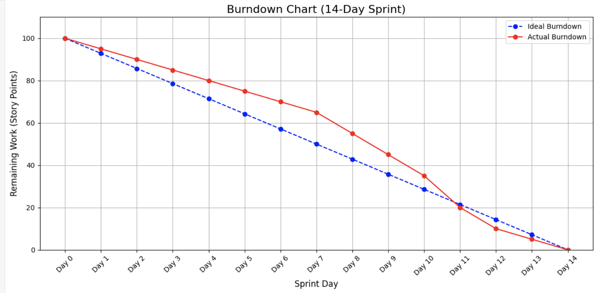

# Actual iteration - 1 board

**Start Date**: Week3

**End Date**: week6

**Checklist**:

  * GitHub entry timestamps
  * User stories are correct: see p39

*Assumed Velocity*: ?? 

*Number of developers*: ??

*Total estimated amount of work*: YY days

## User stories or tasks (see chapter 4):

### Story 1

  * **User Story**: View and Manage Booking Schedule, priority High, estimated 3 days
  * **Tasks**:
    * Task - 1: React UI Design & Implementation (React), priority High, estimated 1.5 days
    * Task - 2: Express API Development & Integration (Express + MySQL), priority High, estimated 1 day
    * Task - 3: Booking Logic & Time Conflict Handling (Express + MySQL), priority High, estimated 1 day
    * Task - 4: Testing & Documentation (React + Express), priority Medium, estimated 0.5 days

### Story 2

  * **User Story**: Search and Filter Cleaning Services, priority High, estimated 3 days
  * **Tasks**:
    * Task - 1: React UI Design & Implementation (React), priority High, estimated 1.5 days
    * Task - 2: Express API Development & Integration (Express + MySQL), priority High, estimated 1 day
    * Task - 3: Search & Filter Logic Implementation (Express + MySQL), priority High, estimated 1 day
    * Task - 4: Testing & Documentation (React + Express), priority Medium, estimated 0.5 days

### Story 3

  * **User Story**: Secure and Convenient Payment, priority High, estimated 2 days
  * **Tasks**:
    * Task - 1: Payment UI Design & Implementation (React), priority High, estimated 1 day
    * Task - 2: Backend Payment API & Security Logic Development (Express + MySQL + Payment Gateway), priority High, estimated 0.8 days
    * Task - 3: Testing & Documentation (React + Express), priority Medium, estimated 0.2 days

### Story 4

  * **User Story**: Provider Manage Booking Requests, priority Medium, estimated 2 days
  * **Tasks**:
    * Task - 1: Booking Requests UI & Interaction Implementation (React), priority Medium, estimated 1 day
    * Task - 2: Backend Booking Requests API & Status Update Logic (Express + MySQL), priority Medium, estimated 0.8 days
    * Task - 3: Testing & Documentation (React + Express), priority Medium, estimated 0.2 days

### Story 5

  * **User Story**: Evaluate and Communicate with Service Providers, priority Medium, estimated 2 days
  * **Tasks**:
    * Task - 1: Ratings, Reviews UI & Messaging Interface Implementation (React), priority Medium, estimated 1 day
    * Task - 2: Backend API for Ratings, Reviews & Messaging (Express + MySQL), priority Medium, estimated 0.8 days
    * Task - 3: Testing & Documentation (React + Express), priority Medium, estimated 0.2 days

### Story 6

  * **User Story**: Set Service Details and Pricing, priority Medium, estimated 2 days
  * **Tasks**:
    * Task - 1: Service Details & Pricing UI Implementation (React), priority Medium, estimated 1 day
    * Task - 2: Backend API for Service Details & Pricing Management (Express + MySQL), priority Medium, estimated 0.8 days
    * Task - 3: Testing & Documentation (React + Express), priority Medium, estimated 0.2 days

### Story 7

  * **User Story**: Manage Orders and Payment Records, priority Medium, estimated 2 days
  * **Tasks**:
    * Task - 1: Orders Management UI & Payment History Interface Implementation (React), priority Medium, estimated 1 day
    * Task - 2: Backend API for Orders Modification & Payment Records (Express + MySQL), priority Medium, estimated 0.8 days
    * Task - 3: Testing & Documentation (React + Express), priority Medium, estimated 0.2 days

## In progress:

  * Task - 2 (developer name or initials), date started
  * ...

## Completed:

  * Task - 3 (developer name or initials), date completed
  * ...

## Burn Down for iteration - 1 (see chapter 4):

**Update this at least once per week**

  * 4 weeks left, xx days of estimated amount of work
  * 2 weeks left, xx days
  * 1 weeks left, xx days
  * 0 weeks left, xx days
  * **Actual Velocity**: ??