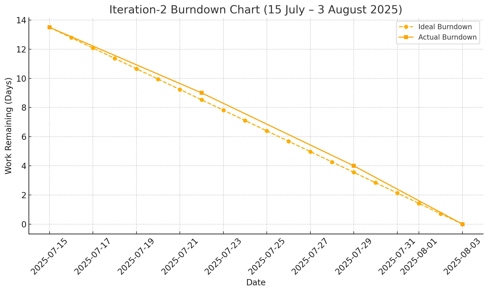

# ✅ Iteration-2 Scrum Board (with *Improvement*)

**Start Date:** 2025-07-15  
**End Date:** 2025-08-03 *(3 weeks)*

---

## 📋 Checklist

- [x] GitHub entry timestamps  
- [x] User stories validated (see p.39)

---

## ⚙️ Velocity & Capacity

- **Assumed Velocity from Iteration-1:**  
  16 dev-days in 4 weeks → **4 dev-days/week**
- **Estimated Velocity for 3 Weeks:**  
  3 weeks × 4 dev-days/week = **12 dev-days**
- **Number of Developers:** 3
- **Total Estimated Workload:** **13.5 days**

---

## 📌 User Stories and Tasks

### **Story 1: Deploy Project to Cloud** *(Improvement)*
- **Priority:** High  
- **Estimated Time:** 2.5 days  
- **Stack:**
  - Frontend: Vercel  
  - Backend: Render  
  - Database: Railway
- **Tasks:**
  - [ ] **Task 1.1:** Deploy frontend (React) to Vercel – 0.5 day
  - [x] **Task 1.2:** Deploy backend (Express API) to Render – 1 day *(Completed: 2025-08-10)*
  - [ ] **Task 1.3:** Connect and configure Railway database – 0.5 day *(Started: 2025-08-06, Dev: JS)*
  - [ ] **Task 1.4:** Configure environment variables and HTTPS testing – 0.5 day

---

### **Story 2: Provider Booking Request Management** *(Improvement)*
- **Priority:** Medium  
- **Estimated Time:** 2 days  
- **Tasks:**
  - [ ] **Task 2.1:** UI polishing and interaction improvement – 1 day
  - [x] **Task 2.2:** Enhance backend logic for accepting/rejecting bookings – 0.8 day *(Completed: 2025-08-09, Dev: CK)*
  - [ ] **Task 2.3:** Testing and final bug fixes – 0.2 day

---

### **Story 3: Evaluate and Communicate with Providers** *(Improvement)*
- **Priority:** Medium  
- **Estimated Time:** 2 days  
- **Tasks:**
  - [ ] **Task 3.1:** Improve messaging UI – 1 day
  - [ ] **Task 3.2:** Final backend testing and error handling – 0.3 day

---

### **Story 4: Manage Orders and Payment Records** *(Improvement)*
- **Priority:** Medium  
- **Estimated Time:** 2 days  
- **Tasks:**
  - [ ] **Task 4.1:** UI improvements for managing bookings and payments – 1 day
  - [ ] **Task 4.2:** Backend logic for cancellation and record access – 0.8 day
  - [ ] **Task 4.3:** Unit testing – 0.2 day

---

### **Story 5: Improve UI/UX and Mobile Responsiveness** *(Improvement)*
- **Priority:** Medium  
- **Estimated Time:** 2 days  
- **Tasks:**
  - [ ] **Task 5.1:** Tailwind layout adjustments for mobile – 1 day
  - [ ] **Task 5.2:** Improve color palette, buttons, spacing – 1 day

---

### **Story 6: End-to-End Testing Setup** *(Improvement)*
- **Priority:** Low  
- **Estimated Time:** 3 days  
- **Tasks:**
  - [ ] **Task 6.1:** Write test flows for login, booking, payment – 2 days
  - [ ] **Task 6.2:** Compile report and test summary – 1 day

---

---

## 📉 Burndown Chart – Iteration 2 (3 Weeks)

| Week         | Remaining Work (days) |
|--------------|------------------------|
| Week 0 (Start) | 13.5                  |
| Week 1        | 8                     |
| Week 2        | 3                     |
| Week 3 (End)  | 0                     |

- **Actual Velocity:** 13.5 days / 3 weeks = **4.5 dev-days/week**
