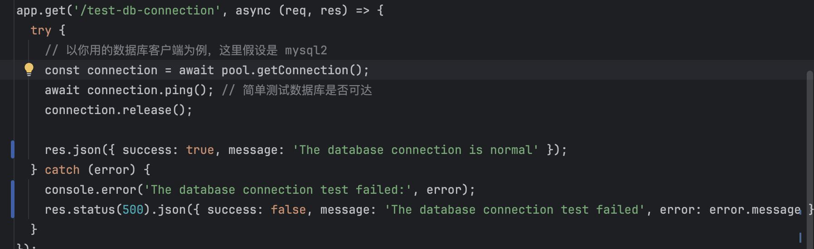
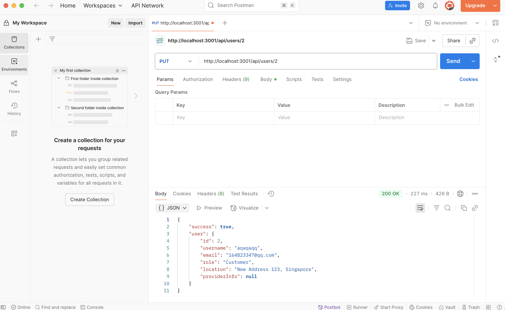

# 🧪 Test Project Summary

## ✅ Test 1: In-Code Unit Testing
Basic test code was added directly inside the backend project to verify key functionality such as database connection, user registration, and login logic. These tests ensure that core modules behave as expected under normal and edge-case inputs.

## ✅ Test 2: API Testing with Postman
Postman was used to manually test REST API endpoints, including:

- User registration and login
- Provider profile updates
- Booking creation
- Role-based access control

Tests were performed using realistic request bodies and verified through response status codes and returned data.
